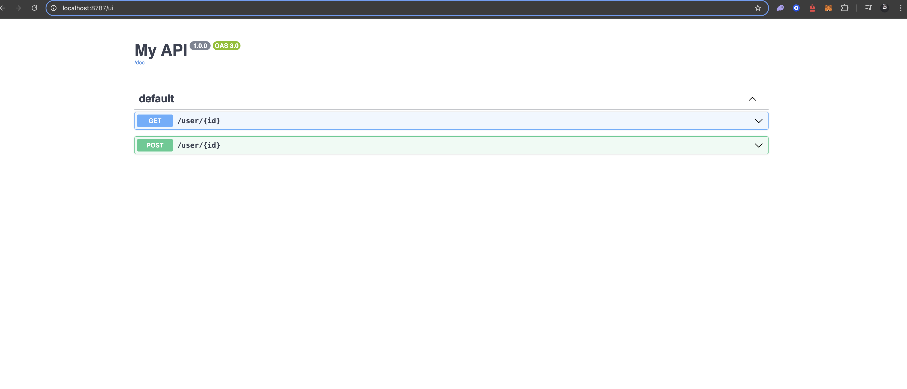

## OpenAPI Hono API with Swagger UI :

This project demonstrates an API built using the Hono framework, featuring automatic OpenAPI specification generation, route validation with zod-openapi, and interactive API documentation using Swagger UI.

### Features :
	•	Lightweight Hono Framework: A high-performance framework for building APIs.
	•	Automatic OpenAPI Specification: Powered by zod-openapi to define and validate routes.
	•	Swagger UI Integration: Easily explore and test your API endpoints via /ui.
	•	Dynamic API Routes:
	•	GET /user/{id}: Fetch user details.
	•	POST /user/{id}: Create or process user details.
	•	Validation with Zod: Ensures strong typing and validation for API inputs and outputs.

### Installation and Usage :

#### Steps to Run
	1.	Clone the repository:

```bash
git clone https://github.com/your-repo-name.git
cd OpenAPI-spec
```


	2.	Install dependencies:

```bash
npm install
```


	3.	Start the server:

```bash
npm start
```


	4.	Access the API documentation in your browser:
	•	Swagger UI: http://localhost:8787/ui
	•	OpenAPI JSON: http://localhost:8787/doc

#### API Endpoints : 

GET /user/{id}

Fetch details of a user based on their id.

Parameters:
	•	id (path parameter): The ID of the user.

Example Request:

GET /user/1 HTTP/1.1
Host: localhost:8787

Example Response:

{
  "id": "1",
  "age": 20,
  "name": "Ultra Man"
}

POST /user/{id}

Simulates creating or processing user details based on their id.

Parameters:
	•	id (path parameter): The ID of the user.

Example Request:

```bash
POST /user/1 HTTP/1.1
Host: localhost:8787
```

Example Response:

```bash
{
  "id": "1",
  "age": 20,
  "name": "Ultra Man"
}
```

Project Structure

```bash
OpenAPI-spec/
├── src/
│   ├── index.ts         # Main entry point with API routes
│   ├── inputs/          # Zod schemas for request validation
│   ├── outputs/         # Zod schemas for response validation
│   ├── generated/       # Generated service files
├── package.json         # Project dependencies and scripts
```
#### How It Works :
	1.	Hono Framework:
	•	The OpenAPIHono object is used to define routes with OpenAPI support.
	•	Routes are created using the createRoute function.
	2.	API Endpoints:
	•	Each route specifies its method, path, parameters, and responses using zod-openapi.
	3.	Swagger Integration:
	•	API documentation is automatically generated and served using the swaggerUI function.
	4.	OpenAPI JSON:
	•	A JSON file is served at /doc that contains the OpenAPI 3.0 specification.

#### Swagger UI

The interactive Swagger UI documentation is available at /ui. Below is an example screenshot:



